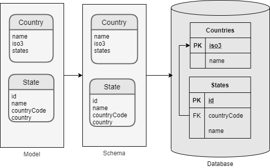
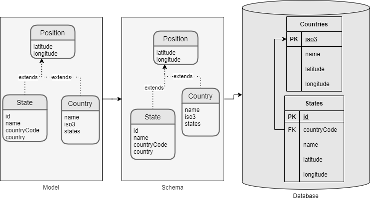
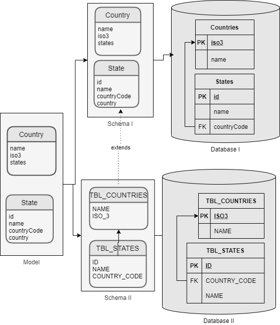

# Lambda ORM

**IMPORTANT: the library is in an Alpha version!!!**

LambdaORM is an intermediary between the business model and the persistence of the data.

Completely decoupling the business model from the data layer.

For this use:

- Queries written in lambda expressions
- Definition of schemas by decoupling the model from the database.

## Features

- Expressions
	- Simple expressions based on javascript lambda.
	- String expressions
	- Implicit joins and group by
	- Eager loading using the Include() method.
	- Metadata
- Schema
	- Decoupling the business model from the data layer
	- Configuration in json or yml formats
	- mapping
	- Extends entities and schemas
	- Environment variables
	- define index, unique key, constraints
- CLI
	- Init and update commands
	- Run expressions
	- Sync and drop schema
	- Imports and exports
- Repositories
- Transactions
- Using multiple database connections

## Lambda expressions

The [lambda expressions](https://developer.mozilla.org/en-US/docs/Web/JavaScript/Reference/Functions/Arrow_functions) are written based on the programming language itself, referring to the business model, completely abstracting from the database language and its structure.

Example:

```ts
Countries.page(1,10).include(p => p.states.map(p=> [p.name,p.latitude,p.longitude] ))
```

The engine also allows us to write the expressions in a string.

```ts
'Countries.page(1,10).include(p => p.states.map(p=> [p.name,p.latitude,p.longitude] ))'
```

### Advantage:

 - Use of the same programming language.
 - It is not necessary to learn a new language.
 - Easy to write and understand expressions.
 - Use of the intellisense offered by the IDE to write the expressions.
 - Avoid syntax errors.

## Schema

It is the nexus between the business model and the persistence of the data.

The classes that represent the business model are completely clean, without any attributes that link them to persistence.

All the configuration necessary to resolve the relationship between the business model and persistence is done in the schema, which is configuration.

This configuration can be done in a yaml, json file or passed as a parameter when initializing the ORM.

The purpose of this ORM is to use javascript syntax to write query expressions. Which will be translated into the SQL statement corresponding to the database engine.

### Examples:

#### Simple

The schema defines how the entities of the model are mapped with the database tables.



[lab](https://github.com/FlavioLionelRita/lambdaorm-lab01)

#### Extend entities

In this scheme we can see how to extend entities.



To understand an entity we use the extends attribute in the definition of the entity

```yaml
  entities:
    - name: Positions	
      abstract: true
      properties:
        - name: latitude
          length: 16
        - name: longitude
          length: 16
    - name: Countries
      extends: Positions
```

[lab](https://github.com/FlavioLionelRita/lambdaorm-lab02)

#### Extend schemas

In this scheme we can see how to extend the schema.



We use the extends attribute in the definition of the schema to extend it.

```yaml
schemas:
  - name: countries    
  - name: countries2
    extends: countries
```

[lab](https://github.com/FlavioLionelRita/lambdaorm-lab03)

#### One schema related multiples databases

This schema has two entities that are in different databases.


The database attribute is used in the entity to be able to specify that an entity is in a database other than the default of the schema.

```yaml
- name: States
  database: mydb2
```

[lab](https://github.com/FlavioLionelRita/lambdaorm-lab04)

### Config

When the orm.init () method is invoked, the initialization of the orm will be executed from the configuration.

This configuration contains the main sections, paths, databases and schemas.

- In the app section, the general configuration of the application is set, such as the main paths, default database, etc.
- In the databases section the databases to which we are going to connect and which is the corresponding schema are defined
- In the section of diagrams, the entities, their relationships and their mapping with the database are defined.

Example:

```json
{
  "app:": { "src": "src", "data": "data" ,"models":"models","defaultDatabase": "mydb" },
  "databases": [
    {
      "name": "mydb",
      "dialect": "mysql",
      "schema": "location",
      "connection": "$CNN_MYSQL"
    }
  ],
  "schemas": [
    {
      "name": "location",
      "enums": [],
      "entities": [
        {
          "name": "Country",
          "mapping": "COUNTRY",
          "primaryKey": [ "id"  ],
          "uniqueKey": [ "name" ],
          "properties": [
            { "name": "id", "mapping": "ID", "type": "integer","nullable": false },
            { "name": "name","mapping": "NAME", "nullable": false, "type": "string", "length": 127 },
            { "name": "alpha2","mapping": "ALPHA_2", "nullable": false,"type": "string","length": 2 },
            { "name": "alpha3", "mapping": "ALPHA_3", "nullable": false, "type": "string", "length": 3 }
          ]
        }
      ]
    }
  ]
}
```

There are the following options to define the settings.

- Invoke the orm.init () method without the first argument and write this configuration in a file called lambdaorm.json or lambdaorm.yaml in the root of the project.
according to the lambdaorm extension you will know how to read it.

- Invoke the orm.init () method, pass as an argument the path where the configuration file is located.
This path must include the extension .yaml or .json since this way we will know how to read it.

- Invoke the orm.init () method passing the configuration as a json object as an argument

Example passing the path of the configuration file:

```ts
import { orm } from 'lambdaorm'
(async () => {
	await orm.init('/home/my/db/book.yaml')
	try {
		const result = await orm.expression('Loan.map(p=>{user:p.reader.name,book:p.book.title,date:p.date})').execute('mydb')
		console.log(result)	
	} catch (error) {
		console.log(error)
	} finally {
		await orm.end()
	}
})()
```

- [more info](https://github.com/FlavioLionelRita/lambdaorm/wiki/Config)

## Expressions:

To write the expressions we use methods, operators and functions.

### Methods:

Starting from the entity we have the following methods.

|Method    		|Description                                   										| SQL Equivalent								|																																								|
|:-----------|:-----------------------------------------------------------------|:------------------------------|:-----------------------------------------------------------------------------:|
|filter			 | To filter the records.																						| WHERE 												|[more info](https://github.com/FlavioLionelRita/lambdaorm/wiki/Query-Select)		|
|having 		 | To filter on groupings.																					|	HAVING 												|[more info](https://github.com/FlavioLionelRita/lambdaorm/wiki/Query-Select)		|
|map				 | To specify the fields to return. 																| SELECT 												|[more info](https://github.com/FlavioLionelRita/lambdaorm/wiki/Query-Select)		|
|distinct		 | to specify the fields to return by sending duplicate records.		|																|[more info](https://github.com/FlavioLionelRita/lambdaorm/wiki/Query-Select)		|
|first			 | returns the first record																					| SELECT + ORDER BY + LIMIT 		|[more info](https://github.com/FlavioLionelRita/lambdaorm/wiki/Query-Select)		|
|last 		 	 | returns the last record																					|	SELECT + ORDER BY DESC + LIMIT|[more info](https://github.com/FlavioLionelRita/lambdaorm/wiki/Query-Select)		|
|take 		 	 | returns one record																								|	SELECT +  LIMIT 							|[more info](https://github.com/FlavioLionelRita/lambdaorm/wiki/Query-Select)		|
|sort				 | To specify the order in which the records are returned.					| ORDER BY 											|[more info](https://github.com/FlavioLionelRita/lambdaorm/wiki/Query-Select)		|
|page				 | To paginate.																											| LIMIT  (MySQL)								|[more info](https://github.com/FlavioLionelRita/lambdaorm/wiki/Query-Select)		|
|include		 | To get records of related entities																|																|[more info](https://github.com/FlavioLionelRita/lambdaorm/wiki/Query-Include)	|
|insert			 | To insert records																								| INSERT												|[more info](https://github.com/FlavioLionelRita/lambdaorm/wiki/Query-Update)		|
|update			 | To update records always including a filter											| UPDATE with WHERE							|[more info](https://github.com/FlavioLionelRita/lambdaorm/wiki/Query-Update)		|
|updateAll	 | to be able to update all the records of an entity								| UPDATE without WHERE					|[more info](https://github.com/FlavioLionelRita/lambdaorm/wiki/Query-Update)		|
|delete			 | To delete records always including a filter											| DELETE with WHERE							|[more info](https://github.com/FlavioLionelRita/lambdaorm/wiki/Query-Delete)		|
|deleteAll	 | To be able to delete all records of an entity										| DELETE without WHERE					|[more info](https://github.com/FlavioLionelRita/lambdaorm/wiki/Query-Delete)		|
|bulkinsert	 | to insert records in bulk																				| INSERT												|[more info](https://github.com/FlavioLionelRita/lambdaorm/wiki/Query-BulkInsert)|

There are no methods for the INNER JOIN clause since it is deduced when navigating through the relations of a property.

There are no methods for the GROUP BY clause since this is deduced when grouping methods are used.

### Operators

The operators used are the same as those of javascript.

below access to their documentation:

|Category    	|Operators                				|																																												|
|:------------|:-------------------------------:|:-------------------------------------------------------------------------------------:|
|Arithmectic 	| -, +, *, /, **, //, % 					| [more info](https://github.com/FlavioLionelRita/lambdaorm/wiki/Operators-Arithmectic) |
|Bitwise 			| ~,&,^,<<,>> 										| [more info](https://github.com/FlavioLionelRita/lambdaorm/wiki/Operators-Bitwise)			|
|Comparison 	| ==, ===, !=, !==, >, <, >=, <= 	| [more info](https://github.com/FlavioLionelRita/lambdaorm/wiki/Operators-Comparison)	|
|Logical 			| !, && 													| [more info](https://github.com/FlavioLionelRita/lambdaorm/wiki/Operators-Logical) 		|
|Array 				| [] 															| [more info](https://github.com/FlavioLionelRita/lambdaorm/wiki/Operatos-Array) 				|

### Functions

In the case of functions, some correspond to javascript functions and others are specific to sql

below access to their documentation:

|Category    	|functions                																						|																																												|
|:------------|:--------------------------------------------------------------------|--------------------------------------------------------------------------------------:|
|Numeric			|abs,ceil,cos,exp,ln,log,remainder,round,sign,sin,tan,trunc...				|[more info](https://github.com/FlavioLionelRita/lambdaorm/wiki/Functions-Numeric)			|
|String				|chr,lower,lpad,ltrim,replace,rpad,rtrim,substr,trim,upper,concat...	|[more info](https://github.com/FlavioLionelRita/lambdaorm/wiki/Functions-String)				|
|Datetime			|curtime,today,now,time,date,datetime,year,month,day,weekday,hours...	|[more info](https://github.com/FlavioLionelRita/lambdaorm/wiki/Functions-Datetime)			|
|Convert			|toString,toJson,toNumber																							|[more info](https://github.com/FlavioLionelRita/lambdaorm/wiki/Functions-Convert)			|
|Nullable			|nvl,nvl2,isNull,isNotNull																						|[more info](https://github.com/FlavioLionelRita/lambdaorm/wiki/Functions-Nullable)			|
|General			|as,distinct																													|[more info](https://github.com/FlavioLionelRita/lambdaorm/wiki/Functions-General)			|
|Sort					|asc,desc																															|[more info](https://github.com/FlavioLionelRita/lambdaorm/wiki/Function-Sort)					|
|Conditionals	|between,includes																											|[more info](https://github.com/FlavioLionelRita/lambdaorm/wiki/Functions-Conditionals)	|
|Group				|avg,count,first,last,max,min,sum																			|[more info](https://github.com/FlavioLionelRita/lambdaorm/wiki/Functions-Group)				|
|Metadata			|user,source																													|[more info](https://github.com/FlavioLionelRita/lambdaorm/wiki/Functions-Metadata)			|

## Usage

To work with the orm we can do it using the singleton object called "orm" or using repositories.

### Objeto __orm__

This orm object acts as a facade and from this we access all the functionalities.

To execute a query we have two methods

#### __Lambda method__:

This method receives the expression as a javascript lambda function.

If we are going to write the expression in the code, we must do it with the lambda function, since in this way we will have the help of intellisense and we will make sure that the expression does not have syntax errors.

```ts
import { orm } from 'lambdaorm'

(async () => {
	await orm.init()	
	const exp = (country:string)=>
				Products.filter(p => (p.price > 5 && p.supplier.country == country) || (p.inStock < 3))
						.having(p => max(p.price) > 50)
						.map(p => ({ category: p.category.name, largestPrice: max(p.price) }))
						.sort(p => desc(p.largestPrice))

	const result = await orm.lambda(exp).execute({ country: 'USA' },'mydb')
	console.log(JSON.stringify(result, null, 2))
	await orm.end()
})()
```

where the SQL equivalent of the expression is:

```sql
SELECT c.CategoryName AS `category`, MAX(p.UnitPrice) AS `largestPrice` 
FROM Products p 
INNER JOIN Suppliers s ON s.SupplierID = p.SupplierID 
INNER JOIN Categories c ON c.CategoryID = p.CategoryID 
WHERE ((p.UnitPrice > 5 AND s.Country = ?) OR p.UnitsInStock < 3) 
GROUP BY c.CategoryName 
HAVING MAX(p.UnitPrice) > 50 
ORDER BY `largestPrice` desc 
```

#### __Expression method__:

This method receives the expression as a text string.

if the expression comes from somewhere else, UI, CLI command, persisted, etc, in this case we will use the expression in a string

```ts
import { orm } from 'lambdaorm'

(async () => {
	await orm.init()
	const country = 'USA'
	const exp = `Products.filter(p => (p.price > 5 && p.supplier.country == country) || (p.inStock < 3))
						.having(p => max(p.price) > 50)
						.map(p => ({ category: p.category.name, largestPrice: max(p.price) }))
						.sort(p => desc(p.largestPrice))`

	const result = await orm.expression(exp).execute({ country: country },'mydb')
	console.log(JSON.stringify(result, null, 2))
	await orm.end()
})()
```

### Repositories

Repositories are associated with an entity and have several methods to interact with it.

Example:

```ts
import { orm } from 'lambdaorm'
import { ProductRespository } from './models/northwind'

(async () => {
	await orm.init()
	const productRepository = new ProductRespository('mydb')
	const country = 'USA'
	const result = awaitproductRepository.query().filter(p => (p.price > 5 && p.supplier.country === country) || (p.inStock < 3))
			.having(p => max(p.price) > 50)
			.map(p => ({ category: p.category.name, largestPrice: max(p.price) }))
			.sort(p => desc(p.largestPrice))
			.execute({ country: country })
	
	console.log(JSON.stringify(result, null, 2))
	await orm.end()
})()
```

[More info](https://github.com/FlavioLionelRita/lambdaorm/wiki/Repository)

### Includes:

LambdaORM includes the Include method to load related entities, both for OnetoMany, manyToOne and oneToOne relationships.

We can also apply filters or bring us some fields from the related entities.

For each include, a statement is executed bringing all the necessary records, then the objects with relationships are assembled in memory. In this way, multiple executions are avoided, considerably improving performance.

Includes can be used in selects, insert, update, delete, and bulckinsert.

Example:

``` ts
import { orm } from 'lambdaorm'
(async () => {
	await orm.init()
	const expression = (id:number) => Orders
		.filter(p => p.id === id)
		.include(p => [p.customer.map(p => ({ name: p.name, address: concat(p.address, ', ', p.city, ' (', p.postalCode, ')  ', p.country) })),
			p.details.include(p => p.product
				.include(p => p.category.map(p => p.name))
				.map(p => p.name))
				.map(p => [p.quantity, p.unitPrice])])
		.map(p => p.orderDate)

	const result = await orm.lambda(expression).execute('mydb')
	console.log(JSON.stringify(result, null, 2))
	await orm.end()
})()
```

The previous sentence will bring us the following result:

```json
[[
{
	"orderDate": "1996-07-03T22:00:00.000Z",
	"customer": { "name": "Vins et alcools Chevalier", "address": "59 rue de l'Abbaye, Reims (51100)  France"
	},
	"details": [
		{
			"quantity": 12, "unitPrice": 14,
			"product": { "name": "Queso Cabrales", 	"category": { "name": "Dairy Products"}
			}
		},
		{
			"quantity": 10, "unitPrice": 9.8,
			"product": { "name": "Singaporean Hokkien Fried Mee",	"category": { "name": "Grains/Cereals" 	}}
		},
		{
			"quantity": 5, "unitPrice": 34.8,
			"product": { "name": "Mozzarella di Giovanni", "category": { "name": "Dairy Products"	}	}
		}
	]
}
]]
```

[More info](https://github.com/FlavioLionelRita/lambdaorm/wiki/Query-Include)

### Transactions

To work with transactions use the orm.transaction method.

This method receives the name of the database as the first argument and as the second it is a callback function that does not pass a Transaction object, in the example we name it tr.

We use the lambda or expression method to execute the sentence (as we found it written).

When we reach the end and return the callback, the orm will internally execute the COMMIT, if there is an exception, internally the ROLLBACK will be executed

Example

``` ts
import { orm } from 'lambdaorm'

(async () => {

const order={customerId:"VINET",employeeId:5,orderDate:"1996-07-03T22:00:00.000Z",requiredDate:"1996-07-31T22:00:00.000Z",shippedDate:"1996-07-15T22:00:00.000Z",shipViaId:3,freight:32.38,name:"Vins et alcools Chevalier",address:"59 rue de l-Abbaye",city:"Reims",region:null,postalCode:"51100",country:"France",details:[{productId:11,unitPrice:14,quantity:12,discount:!1},{productId:42,unitPrice:9.8,quantity:10,discount:!1},{productId:72,unitPrice:34.8,quantity:5,discount:!1}]};

try {
orm.transaction('mydb', async (tr) => {
	// create order
	const orderId = await tr.lambda(() => Orders.insert().include(p => p.details), order)
	// get order
	const result = await tr.lambda((id:number) => Orders.filter(p => p.id === id).include(p => p.details), { id: orderId })
	const order2 = result[0]
	// updated order
	order2.address = 'changed 59 rue de l-Abbaye'
	order2.details[0].discount = true
	order2.details[1].unitPrice = 10
	order2.details[2].quantity = 7
	const updateCount = await tr.lambda(() => Orders.update().include(p => p.details), order2)
	console.log(updateCount)
	// get order
	const order3 = await tr.lambda((id:number) => Orders.filter(p => p.id === id).include(p => p.details), { id: orderId })
	console.log(JSON.stringify(order3))
	// delete
	const deleteCount = await tr.lambda(() => Orders.delete().include(p => p.details), order3[0])
	console.log(deleteCount)
	// get order
	const order4 = await tr.lambda((id:number) => Orders.filter(p => p.id === id).include(p => p.details), { id: orderId })
	console.log(JSON.stringify(order4))
})
} catch (error) {
	console.log(error)
}
})()
```

[More info](https://github.com/FlavioLionelRita/lambdaorm/wiki/Transaction)

### Metadata

Lambda ORM has the following methods to extract metadata information from expressions.

To execute these methods it is not necessary to connect to the database.

|method    		|Description          															|Path                         						  						|
|:------------|:--------------------------------------------------|:------------------------------------------------------|
|	parameters	| returns the list of parameters in the expression	| orm.lambda(query).parameters(schema) 									|
|	model				| returns the model of the result in an execution		| orm.lambda(query).model(schema)												|
|	metadata		| returns the metadata of the expression						| orm.lambda(query).metadata(schema)										|
|	sentence		| returns the sentence in the specified dialect			| orm.lambda(query).sentence('mysql','northwind')				|

- [more info](https://github.com/FlavioLionelRita/lambdaorm/wiki/metadata)

## Installation

```sh
npm install lambdaorm
```

## CLI

Install the package globally to use the CLI commands to help you create and maintain projects

```sh
npm install lambdaorm-cli -g
```

- [CLI package](https://www.npmjs.com/package/lambdaorm-cli)

## Documentation

- [Wiki](https://github.com/FlavioLionelRita/lambdaorm/wiki)
- [Source Code](https://github.com/FlavioLionelRita/lambdaorm/blob/main/doc/README.md)

## Labs

### Lab northwind

In this laboratory we will see:

Creating the northwind sample database tables and loading it with sample data. This database presents several non-standard cases such as: - Name of tables and fields with spaces - Tables with composite primary keys - Tables with autonumeric ids and others with ids strings

Since this is the database that was used for many examples and unit tests, you can test the example queries that are in the documentation. We will also see some example queries to execute from CLI

[source code](https://github.com/FlavioLionelRita/lambdaorm-lab-northwind)

### Lab 01

In this laboratory we will see:

- How to use the Lambdaorm-cli commands
- how to create a project that uses lambda ORM
- How to define a schema
- how to run a bulckInsert from a file
- how to export data from a schema
- how to import data into a schema from a previously generated export file

[source code](https://github.com/FlavioLionelRita/lambdaorm-lab01)

### Lab 02

In this laboratory we will see:

- how to create a project that uses lambda ORM
- How to define a schema
- how to extend entities using abstract entities
- How to insert data from a file.
- how to run queries from cli to perform different types of queries

[source code](https://github.com/FlavioLionelRita/lambdaorm-lab02)

### Lab 03

In this laboratory we will see:

- How to insert data from a file to more than one table.
- how to extend entities using abstract entities
- how to extend a schema to create a new one, overwriting the mapping
- how to work with two schemas and databases that share the same model
- how to use imported data from one database to import it into another

[source code](https://github.com/FlavioLionelRita/lambdaorm-lab03)

### Lab 04

In this laboratory we will see:

- How to insert data from a file to more than one table.
- how to extend entities using abstract entities
- how to define a schema that works with entities in different databases
- how to run a bulkinsert on entities in different databases
- how to export and import entity data in different databases

[source code](https://github.com/FlavioLionelRita/lambdaorm-lab04)
